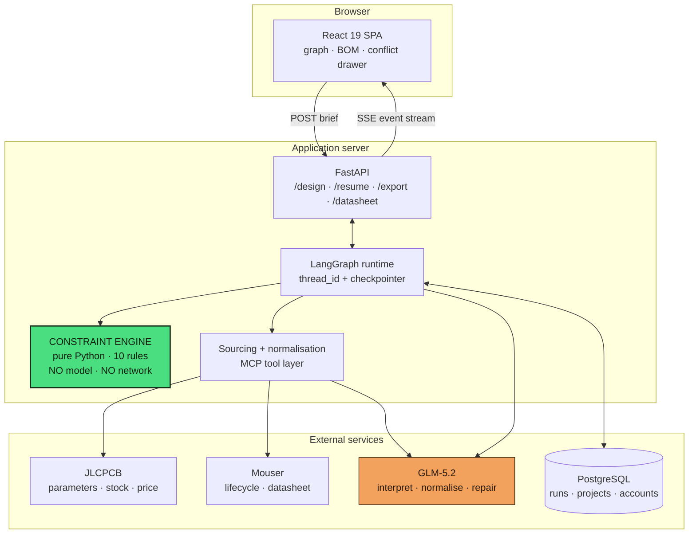
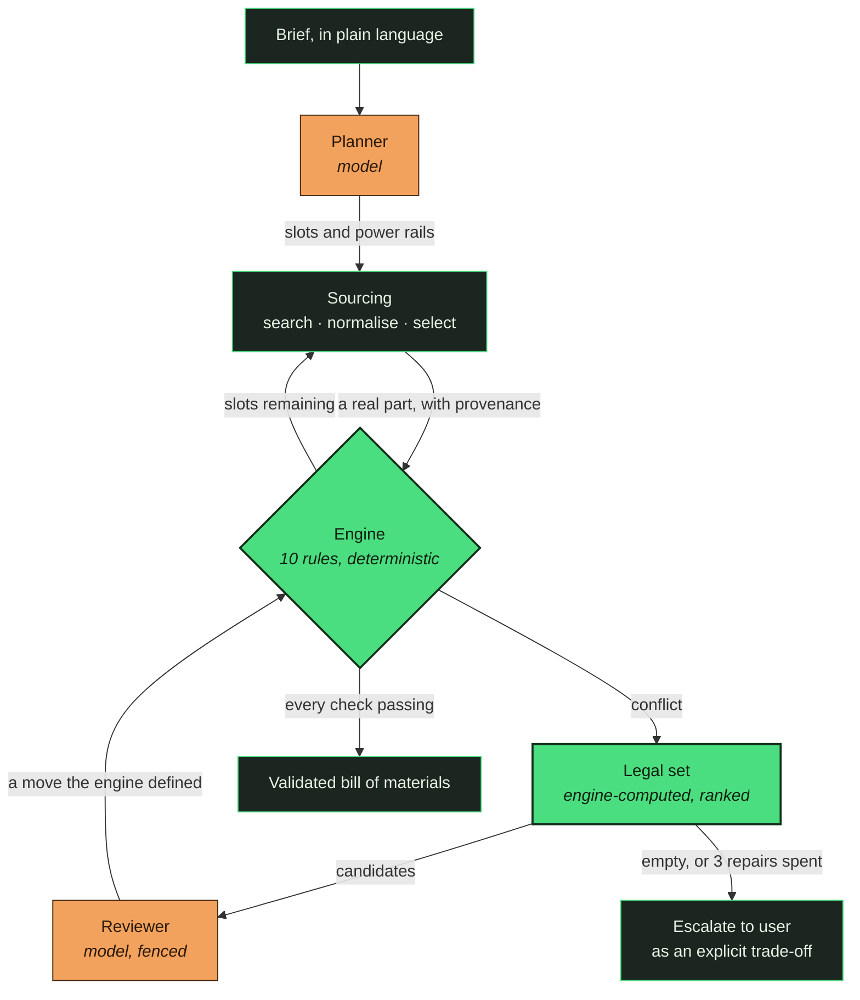
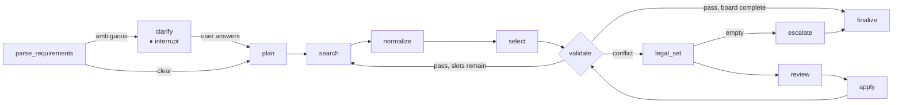
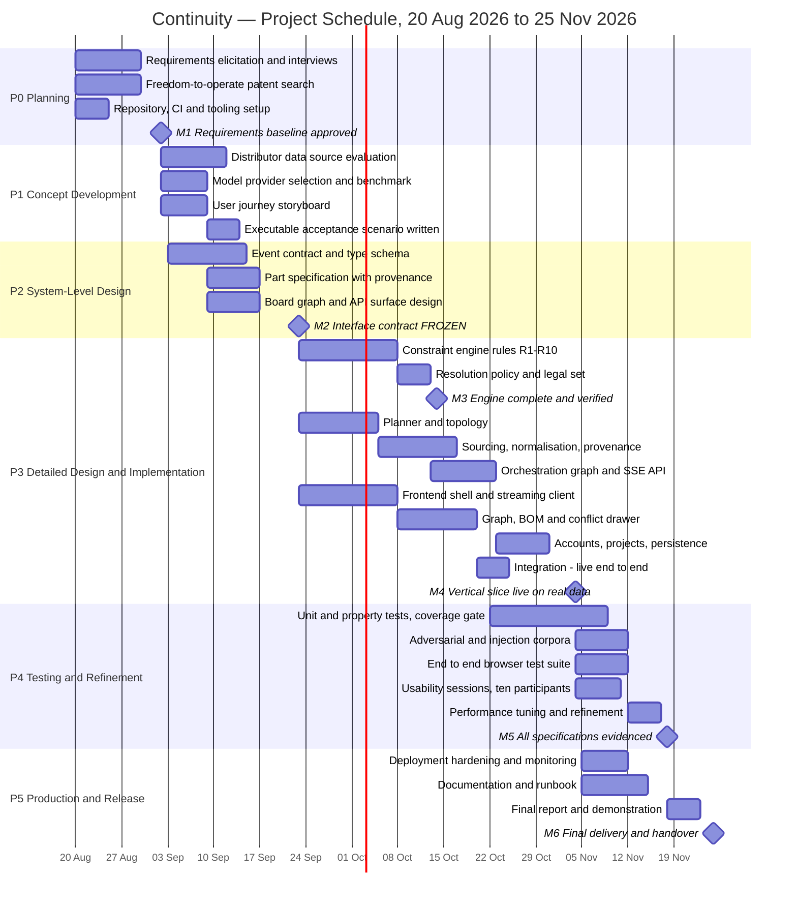

<!--
NOTE TO THE TEAM — DELETE THIS BLOCK BEFORE SUBMISSION.

Synced to the .docx, with fixes applied. Changes made in this pass:

RESTORED (required by proposal_guidelines.pdf, missing from the .docx):
  * Statement of Problem > Background, Previous Related Work, Patent Search
  * Objectives > the scope-exclusion paragraph ("what the project will not do")
  * Milestone schedule table (M1-M6 were referenced everywhere but never defined)
  * Communication and Coordination with Sponsor (was in the TOC, absent from body)
  * Conclusion (was in the TOC, absent from body)

TRIMMED (added from the airline reference, then cut - no course document requires them.
proposal_guidelines.pdf asks Project Management for exactly three things: task phases,
division of responsibilities, and a Gantt chart):
  * Lifecycle model paragraph
  * Work package table
  * Quality assurance and monitoring paragraphs
  * Risk register
  * Function-point effort derivation in the Budget

FIXED:
  * Budget replaced (was still the Penn State boilerplate: $30k PM, Dell, Oracle, taxi)
  * References replaced (were still Fox & McDonald / Houghton / Varian)
  * Team Qualifications written (was still "Here you would place a paragraph...")
  * Two figures both numbered 3; figures renumbered 1-4
  * broken table cross-references; tables now run 1-10 in document order
  * Dangling fragment "Ten rules will be implemented,"
  * "detect, rank, repair, and revalidation project" -> "loop"
  * "not of the same weight.Preliminary" -> missing space
  * Executive Summary said fifteen weeks, Project Management said fourteen
  * "the sponsor call each Friday is described later in this section" now resolves
  * Roster reconciled: Lai Yi (was "Larry"), Samarth (was "Sam")

STILL TO DO: fill [bracketed placeholders]; write the Appendix A resumes. Appendix C is the Word conversion checklist.
-->

> **Singapore, not Shenzhen.** This is a record of the regional submission, kept because it
> is what was true then. It is **superseded** for anything about the current build: the
> finals work lives in [`docs/world-finals/`](world-finals/), and where the two disagree the
> world-finals file is right. Do not read this for the state of the code.
>
> The most likely confusion is the deferred list. This directory has one and
> [`world-finals/DEFERRED.md`](world-finals/DEFERRED.md) has another; the second is the live
> one.

---

# Proposal for the Design of Continuity: A System for Whole-Board Constraint Validation of Electronic Bills of Materials

 

Jerral Chua Fung Yong 
Kataruka Mohika 
Jethani Samarth 
Sinha Armaan 
Jain Sparsh 
Faye Chan 
Lai Yi

**Team Continuity**

College of Computing and Data Science, Nanyang Technological University

  

Submitted to —

Ajith Santhisenan

College of Computing and Data Science, Nanyang Technological University

  

[Submission date]

---

## Contents

| Section | Page |
|---|---|
| Executive Summary | X |
| Statement of Problem | X |
| &nbsp;&nbsp;&nbsp;&nbsp;Background | X |
| &nbsp;&nbsp;&nbsp;&nbsp;Previous Related Work | X |
| &nbsp;&nbsp;&nbsp;&nbsp;Patent Search | X |
| Objectives | X |
| Technical Approach | X |
| &nbsp;&nbsp;&nbsp;&nbsp;Customer Needs | X |
| &nbsp;&nbsp;&nbsp;&nbsp;Target Specifications | X |
| &nbsp;&nbsp;&nbsp;&nbsp;Technology Consideration | X |
| &nbsp;&nbsp;&nbsp;&nbsp;System Architecture/Platform | X |
| Project Management | X |
| &nbsp;&nbsp;&nbsp;&nbsp;Deliverables | X |
| &nbsp;&nbsp;&nbsp;&nbsp;Budget | X |
| &nbsp;&nbsp;&nbsp;&nbsp;Communication and Coordination with Sponsor | X |
| &nbsp;&nbsp;&nbsp;&nbsp;Team Qualifications | X |
| Conclusion | X |
| References | X |
| Appendix A: Résumés of Team Members | X |

---

## Executive Summary

Hardware engineers spend a large share of their design time confirming that independently
chosen components will work together. A survey of 439 engineers found that 77 percent spend
five hours or more each week on this work [Accuris and Fuld, 2026]. The average printed circuit
board still requires 2.9 respins, at approximately $28,500 each [Siemens, 2025].

No current tool performs the check. Distributor search locates individual parts, and
computer-aided design tools capture and verify a schematic. Neither evaluates whether a chosen
set of parts is mutually consistent. Compatibility is a property of the whole board, and every
available interface takes a single part as its unit of query.

This document proposes the design of Continuity, a web application that converts a
plain-language description of a circuit board into a bill of materials validated as a graph.
The system divides the work between two components. A deterministic constraint engine
determines what is broken, a language model selects a resolution strategy, and the engine then
re-validates the result. Ten rules covering voltage, current, thermal dissipation, interface
roles, pin count, availability, temperature grade, footprint, energy budget and rail coverage
will be implemented as pure functions with no network access and no model in their path. The
same board therefore produces the same verdicts on every run. Each verdict names the field that
decided it, quotes that field's value, and identifies the source it was read from. No
compatibility judgement is ever produced by a language model.

A seven-member team will deliver the system in six phases across fourteen weeks, working behind
an event contract frozen in Week 5 so that the engine, the interface and the test suites can
proceed in parallel. The requested budget is $22,517.20, of which 98 percent is personnel.

---

## Statement of Problem

A printed circuit board carries a set of components: a microcontroller, sensors, a radio, power
regulators and passive parts, connected by copper traces. Before any of that is drawn, someone
must decide which components to use. That decision produces the bill of materials, a list of
manufacturer part numbers with quantities and the role each part plays. Everything downstream
depends on it. Procurement buys from it, assembly builds from it, and an error in it survives
every check that follows.

A bill of materials can be internally inconsistent in ways that no drawing tool detects. A
3.3-volt sensor placed on a 5-volt rail is destroyed on first power-up, and the schematic tool
will draw the connection without objection. A regulator rated for 600 mA supplying a radio that
draws 500 mA in transmit and a display that draws 200 mA will brown out under load, though only
intermittently, which is the most difficult class of fault to diagnose. A linear regulator
converting 5 V to 3.3 V at 400 mA dissipates 0.68 W as heat; in a SOT-23-5 package with a
thermal resistance near 200 °C/W, that produces a junction temperature rise of roughly 136 °C,
well beyond the part's rating. A part may also be correct in every electrical respect while the
distributor holds none of it at the quantity a production run requires.

None of this arithmetic is difficult. It is distributed across forty datasheets, and no tool
performs it for the board as a whole.

Existing tools each address one part of the problem. KiCad and Altium verify that the drawing
is well-formed, checking that no pin is left floating and that footprints match, through a
design rule check. They do not read datasheets. Octopart and DigiKey locate parts and report
price and stock, but they have no knowledge of what else is on the board. The gap between the
two exists because compatibility is a whole-board property, while every available interface
takes a single part as its unit of query.

### Background

The sponsor has requested a system that reduces the hours spent selecting and cross-checking
components, and reduces the respins those selections cause. Stated in the sponsor's own terms,
the requirement is a tool that answers one question: given this set of parts and this
application, does the board work, and if not, which number is wrong and where did it come from?

Three conditions have been specified. Judgements must be checkable, so that an engineer can
trace any verdict to a named field in a named source. The system must address supply as well as
physics, because a part that is electrically correct and unavailable is not a solution. It must
also be usable by a non-expert, since much of the wasted effort falls on junior engineers and
student teams who do not yet know which cross-checks matter.

What this problem costs has been measured. A survey of 439 engineers across aerospace and
defence, electronics, automotive, medical devices and industrial manufacturing found that
77 percent spend five hours or more every week reading datasheets and comparing component
alternatives [Accuris and Fuld, 2026]. The same survey found that 58 percent spend more than
thirty hours a month extracting datasheet data by hand. A separate study covering 128,000
engineers reports that 48 percent spend an hour or more each day searching for parts [CADENAS,
2022]. Five hours a week is roughly an eighth of an engineer's working time, spent on a task
that is arithmetic rather than design.

That effort is repeated rather than incurred once. Sixty-eight percent of design projects make
six or more component changes, and 73 percent of boards lose at least one component to a
supply, lifecycle or compliance issue [Accuris and Fuld, 2026; Lifecycle Insights, 2022]. Each
change invalidates the cross-checks already performed on the parts around it.

The cost rises sharply when a problem is found late. Of those surveyed, 51 percent report that
more than 11 percent of their designs require component changes after design freeze, and
46 percent estimate that a single such change costs over $50,000 [Accuris and Fuld, 2026]. The
average printed circuit board requires 2.9 respins before release, each costing approximately
$28,500 and sixteen days [Siemens, 2025]. The problem is therefore inexpensive to prevent
and expensive to discover, which is the case for automating the checks rather than the design.

The literature is not fully consistent on these figures. Altium's whitepaper puts a respin at
$46,000 against Lifecycle Insights' $28,500 [Altium, 2024]. This proposal uses $28,500
throughout, on the grounds of better provenance. An inflated figure costs more credibility with
an informed reader than the larger number buys.

### Previous Related Work

Four bodies of work are adjacent to this project, and the boundary of the proposed scope is
defined by where each of them stops.

The first is component search. Octopart, DigiKey, Mouser and JLCPCB's parts library expose
distributor inventory as structured, queryable data, including price breaks, stock levels and,
in some cases, lifecycle status. These interfaces are the reason the project is feasible now
and would not have been ten years ago. Their limitation is architectural rather than
accidental: the unit of query is a single part, and no interface exists for asking a question
about a set of parts.

The second is electronic design automation. KiCad and Altium Designer are the established tools
for schematic capture and layout, and both perform electrical rule checking. Those checks read
the drawn netlist, covering connectivity, pin types and unconnected nets, rather than
parameters read from a datasheet. Altium's ActiveBOM and Siemens' supply-chain products add
lifecycle and stock awareness to the bill of materials, which is the closest published prior
art to part of the proposed scope. Neither validates parts against each other electrically.

The third is automated board synthesis, which this project deliberately excludes. atopile
describes hardware as code, Quilter automates layout, JITX generates circuits programmatically,
and Flux.ai assists schematic capture. Work in this area has repeatedly arrived at a finding
that the team's own interviews reproduced: engineers want compatibility checking they can audit
rather than a generated board they cannot. Synthesis also requires pin-level connectivity, a
substantially larger data problem than block-level validation, and one that cannot be delivered
responsibly within fourteen weeks.

The fourth is the application of language models to engineering documents. A large recent
literature covers retrieval over technical PDFs, and any general-purpose assistant will state
whether a sensor is compatible with a microcontroller. The failure mode is well documented, and
it determines the architecture proposed here: models produce fluent, confident, unsourced
claims, and an incorrect compatibility claim is indistinguishable in tone from a correct one.
The response adopted in this proposal is to assign the model the judgement work it performs
well while leaving it structurally unable to produce a number.

The team will also conduct its own interviews. A preliminary round of fifteen, across
university electrical engineering programmes, a makerspace, an IEEE student branch, and
competitive robotics and rocketry teams, changed the framing of this proposal [Team Continuity,
2026]. Designing the board is not the bottleneck. Every engineer interviewed described design
as the enjoyable part of the work. The difficulty arises after a chosen part proves unavailable
and a replacement must be found that still fits everything already committed. That finding is
the reason sourcing runs through the same resolution loop as an electrical fault, rather than
being treated as a separate procurement concern.

### Patent Search

A freedom-to-operate review will be completed in Week 2 and appended to this proposal. The
search will cover USPTO full-text, Google Patents, Espacenet and the register of the
Intellectual Property Office of Singapore, across the Cooperative Patent Classification classes
G06F 30/30–30/39 (computer-aided design of electronic circuits), G06F 30/398 (design
verification and rule checking), G06Q 10/087 (inventory and supply-chain management) and
G06Q 30/0601 (electronic catalogue and product-selection systems). Search terms will include
bill of materials validation, component compatibility checking, automated component selection,
and supply chain aware design.

The team's preliminary assessment, which that search will test, is that the contribution is a
system architecture rather than an algorithm. Specifically, it is the division of labour
between a deterministic engine and a fenced language model, together with the requirement that
every verdict carry its provenance. The constraint checks themselves are textbook electrical
engineering and are not patentable subject matter. No patent numbers are asserted in this
proposal. Anything the Week 2 search identifies as material will be reported to the sponsor in
writing before implementation begins on the affected component.

---

## Objectives

This document proposes the design of Continuity, a system that converts a plain-language
description of a circuit board into a bill of materials validated as a graph and traceable to
its sources. The project has four objectives:

&nbsp;&nbsp;&nbsp;&nbsp;(1)&nbsp;&nbsp;a deterministic constraint engine that evaluates every
rule against every part after every placement and cites its evidence;

&nbsp;&nbsp;&nbsp;&nbsp;(2)&nbsp;&nbsp;a sourcing pipeline that fills each component slot with
a real, orderable part and preserves the provenance of every value it reads;

&nbsp;&nbsp;&nbsp;&nbsp;(3)&nbsp;&nbsp;a fenced repair loop in which a language model selects a
strategy from a set the engine has computed, and the engine re-validates the result; and

&nbsp;&nbsp;&nbsp;&nbsp;(4)&nbsp;&nbsp;a streaming web application that allows an engineer who
did not produce a judgement to check it.

The engine is the technical core. It will contain ten rules covering voltage overlap, current
budget, thermal dissipation, interface role matching, pin budget, availability, temperature
rating, footprint, energy budget and rail coverage. Each is a pure function from a board to a
list of verdicts. Each verdict names the field that decided it, quotes that field's value, and
identifies where the value came from. A rule that cannot evaluate returns unchecked and names
the missing field, and it never substitutes a default. Because the engine holds no network
client, no language model and no read of the system clock, the same inputs produce the same
verdicts on every run.

The second objective exists because a validated board composed of parts nobody stocks is not a
result. The pipeline will push numeric constraints into the distributor query rather than
filtering after retrieval, then normalise free-text catalogue values into a single typed
specification.

The third objective addresses what the interviews identified as the real bottleneck. Resolving
a conflict without breaking what is already committed is the difficult part. On a failure the
engine computes a legal set, the participants that may be changed, ranked so that the cheapest
change comes first. The model then selects one strategy from that set. The selection is
validated against the set before it is applied, and an illegal or timed-out choice falls back
to the least disruptive candidate. Repairs per slot are capped at three, after which the
conflict escalates to the user as an explicit trade-off.

The fourth objective exists to make sure that the judgements are checkable. An engineer must be
able to disagree with the tool and establish who is right in under a minute without leaving the
interface. In practice this means a conflict displays every rule that ran on the failing part,
including those that passed, rather than only the rule that failed.

What the project will not do matters as much, because a reader might reasonably assume
otherwise. Continuity will not generate a schematic. It will not lay out or route a board,
assign pins, produce a netlist, simulate a circuit, or emit manufacturing files. The boundary
is drawn at block-level validation for two reasons. The first is evidential: both the published
prior work and the team's own interviews found that engineers want auditable checking rather
than a generated board they must trust. The second is practical: synthesis requires pin-level
connectivity, a substantially larger data problem than the one described here, and the team
will not promise within fourteen weeks what it cannot deliver.

---

## Technical Approach

The proposed approach is based on the following design: the engine decides what is broken and
the model decides what to do about it. After the model makes its decision, the engine re-checks
the model's work.

Every advantage listed in the following section stems from this one rule. Deterministic code is
well-suited to arithmetic but bad at judgement, and the opposite holds true for a language
model. The architecture thus gives each side the half it is good at and makes them meet over a
vocabulary that is defined by the engine.

This architectural separation provides three practical advantages.

- Every verdict is reproducible because the language model never produces any pass or fail.
  This allows the engineers to verify the result consistently during design review without
  having to independently re-check the model's compatibility judgements.
- An incorrect model decision is not the direct cause of an invalid board passing validation.
  The model is only responsible for selecting the repair strategy. After this is done, it is
  the constraint engine which re-runs all the applicable rules, and hence the schema does not
  allow the model to directly declare that two components are compatible.
- This separation reduces the impact of prompt-injection attempts on the validation results. If
  a user brief contains instructions asking the system to report that all checks have passed,
  the language model has no mechanism through which it can produce a pass verdict. Validation
  remains controlled by the deterministic engine rather than by prompt-level filtering.

Accounting for revalidation also provides an additional advantage. Every constraint rule is
re-evaluated after a component is added or replaced, which results in even previously accepted
components being checked again when the board configuration changes. This is an important
feature since component compatibility depends on the entire board rather than on individual
parts in isolation. Electrical conflicts and sourcing issues therefore pass through the same
detect, rank, repair and revalidate loop.

The following subsections describe the customer needs that are addressed by this approach, the
target specifications, selected technologies, and system architecture.

### Customer Needs

The customer needs listed below were derived from the sponsor's request and were further
refined through the fifteen preliminary interviews described in the problem statement. Six
primary customer needs were identified:

- **Reduced manual cross-checking effort.** The system should reduce the time engineers spend
  manually comparing component specifications by automatically performing relevant checks
  across the entire board whenever a component is added or changed.
- **Auditable validation results.** Produced judgements should be traceable to the underlying
  data and source so that an engineer can quickly and easily verify the result within the
  interface.
- **Supply-chain awareness.** Since sourcing issues can require component changes and redesign,
  factors such as availability, lifecycle status and lead time should be treated as design
  constraints alongside electrical constraints such as current and voltage.
- **Explicit handling of missing information.** When required data is unavailable, the system
  should report the corresponding check as unchecked rather than assuming a value or producing
  a false pass.
- **Orderable output.** The final bill of materials should map to real manufacturer part
  numbers with current pricing and stock information, rather than producing theoretically
  suitable suggestions.
- **Accessibility to non-expert users.** The system should be usable by junior engineers and
  students without requiring them to know in advance which compatibility checks need to be
  performed.

These six needs are not of the same weight. Preliminary interviews indicated that auditability
and supply-chain awareness are particularly important in determining whether engineers would
trust and repeatedly use such a system. The target specifications therefore place greater
emphasis on these two requirements.

### Target Specifications

Table 1 lists the specifications that are used to evaluate the final system. Each specification
has a clear acceptance criterion so that it can be tested objectively.

Table 1: Target specifications and their acceptance criteria.

| ID | Specification | Acceptance criterion |
|---|---|---|
| DS-1 | Rule coverage | The engine shall implement at least 10 constraint rules, and each rule must run without network calls, model calls, or access to the system clock. |
| DS-2 | Determinism | The same brief evaluated against the same cached part data shall produce a byte-identical verdict set across 100 consecutive runs. |
| DS-3 | Provenance | 100% of emitted verdicts shall carry field name, verbatim field value, and source identifier, either as a resolvable URL or a named reference table. Zero verdicts with a null source. |
| DS-4 | No substituted defaults | If required data is missing, the rule shall return unchecked and identify which field is missing. No default values may be substituted. Tested across at least 40 boards. |
| DS-5 | End-to-end latency | A validated BOM shall be produced within 130 seconds using live distributor data, and within 35 seconds using recorded data, for boards with up to 12 component slots. |
| DS-6 | Streaming responsiveness | The first event shall appear within 2 seconds of submission, and event sequences must contain no gaps or duplicates, including after pause and resume. |
| DS-7 | Bounded repair | No component slot shall be repaired more than 3 times before escalating to the user, and no run shall fail to terminate. Verified against 10 unsatisfiable boards. |
| DS-8 | Test coverage | Backend test coverage shall be at least 80%, with at least 95% coverage for the constraint engine. |
| DS-9 | Sourceability | Every BOM item shall map to a real manufacturer part number with sufficient distributor stock, or be clearly flagged if the requirement cannot be met. |
| DS-10 | Model fencing | Every repair proposed by the language model shall be checked against the engine's allowed options before it is applied. No unvalidated repair may be accepted. |
| DS-11 | Export fidelity | The exported CSV shall show the final post-repair board and include part number, quantity, price, stock and datasheet URL. It must open correctly in Excel and Google Sheets. |
| DS-12 | Availability | The deployed system shall maintain at least 99% availability during the two-week demonstration period. Cold start must be within 60 seconds and warm health responses within 500 ms. |
| DS-13 | Security | Passwords shall use argon2id, session cookies shall be secure, and no secrets may be committed to version control. |
| DS-14 | Injection resistance | At least 25 prompt-injection test briefs shall produce zero false pass verdicts. |
| DS-15 | Usability | At least 8 out of 10 first-time users shall be able to run a design and identify the cause of a conflict without assistance within 10 minutes. |

The ten rules referred to by DS-1 are set out in Table 2.

Table 2: Constraint rule set.

| Rule | Detects | Core relation |
|---|---|---|
| `voltage_overlap` | A component receiving a voltage outside its supported range | FAIL unless `part.vmin ≤ rail.v ≤ part.vmax` |
| `current_budget` | A power rail requiring more current than its source can provide | FAIL if `Σ i_peak × (1 + margin) > source.i_max`, where margin = 0.15 |
| `thermal_dissipation` | A regulator exceeding its safe operating temperature | Linear: `P = (vin − vout) × I`; switching: `P = vout × I × (1/η − 1)`; `ΔT = P × θJA`; FAIL if `ambient + ΔT > part.temp_max` |
| `interface_role_match` | A peripheral requiring an interface that no controller supports | FAIL unless a compatible interface exists between the peripheral and controller |
| `pin_budget` | More pins being required than the microcontroller provides | FAIL if `Σ peripheral.pins_required > mcu.pins_available` |
| `availability` | Insufficient stock or an unsuitable lifecycle status | FAIL if `stock < req.min_stock`; WARN if lifecycle is NRND or obsolete |
| `temperature_rating` | A component that cannot operate within the required temperature range | FAIL unless `part.temp_min ≤ req.range[0]` and `part.temp_max ≥ req.range[1]` |
| `footprint` | A package unsuitable for the intended assembly process | WARN only |
| `energy_budget` | A power source that cannot support the required operating time | FAIL if `capacity_mAh / continuous_draw_mA < required_runtime_h` |
| `rail_coverage` | A component that is not connected to any power rail | Reported as unchecked, never pass |

For these specifications to be met, there are four critical design issues that need to be
addressed.

- **Provenance must be preserved throughout the architecture**, from distributor payload
  through normalisation and into the engine. This must be included in the part specification
  type before the rules are implemented, because if the normalisation stage discarded the raw
  field associated with a normalised value, DS-3 becomes difficult to satisfy without
  significant redesign.
- **Determinism must be maintained despite language-model-based normalisation.** Parsing
  free-text catalogue values may require a language model, while DS-2 requires deterministic
  results. To reconcile these requirements, normalisation results will be cached by
  manufacturer part number and reused during repeated evaluations.
- **The interface contract is a critical dependency**, as seven team members cannot develop
  different parts without having agreed on an event schema. This interface must be defined and
  finalised early enough to allow for parallel development.
- **Missing data must be handled explicitly** by the engine rather than asserting an
  unsupported point value, especially taking into consideration that missing information is
  commonly expected rather than a rare case. For example, converter efficiency may appear only
  as a graph rather than as a directly published numerical specification.

In addition to these internal design considerations, the system must also operate within
several external technical and resource constraints.

Table 3: Constraints on the design and their consequences.

| Constraint | Consequence for the design |
|---|---|
| Distributor APIs have rate limits | Search queries must be filtered efficiently, and recorded data will be used for repeatable testing. |
| Nexar has a very limited free tier | Nexar will not be used as a primary data source. |
| Some thermal values are not provided for individual parts | The system will use recognised reference data where appropriate and clearly identify the source used [JEDEC, 1995]. |
| Duty-cycle information is often unavailable | Thermal checks will use conservative assumptions and clearly state them in the result. |
| Server-sent event streams have scaling limitations | The initial system will use a single application worker; horizontal scaling is outside the current scope. |
| Free-tier hosting may enter sleep mode | Cold-start delays must be considered and mitigated during the demonstration period. |
| Language-model API access may depend on region | The model endpoint and API configuration must use compatible regions. |
| Fourteen-week term, part-time student effort | Scope is fixed by the phase plan; any addition requires a written change request. |

These constraints also define the boundaries of the delivered system. Continuity will validate
a board at the block level only, and its results will depend on the quality and completeness of
the parameters available to the system. A component with a sparse catalogue entry may therefore
accumulate unchecked verdicts rather than false passes. While this is the intended behaviour,
an unchecked result should never be interpreted as confirmation that a component has been fully
validated.

### Technology Consideration

Table 4 lists the main technologies proposed for each layer of Continuity and explains why each
was selected. The choices are guided by two requirements:

- The constraint engine must be able to operate independently of the language model and
  external services.
- The data layer must be able to preserve the source of every component value used during
  validation.

Table 4: Proposed technologies and their rationale.

| Layer | Selection | Rationale |
|---|---|---|
| Frontend | React 19, TypeScript, Vite, Tailwind CSS | Provides a modern interface stack and supports strongly typed communication with the backend. |
| Interface layer | FastAPI, Python 3.11+ | Supports asynchronous APIs and server-sent events for streaming system progress to the frontend. |
| Orchestration | LangGraph | Provides streaming, pause and resume functionality, and persistent run state required by the workflow [LangChain, n.d.]. |
| Constraint engine | Pure Python | Keeps validation deterministic, easy to test, and independent of external services and the language model. |
| Component parameters, stock and price | JLCPCB | Provides component specifications, availability and pricing that can be used when generating an orderable BOM [JLCPCB, n.d.]. |
| Lifecycle and datasheet information | Mouser | Supplements JLCPCB with lifecycle information and datasheet links that may not otherwise be available [Mouser Electronics, n.d.]. |
| Datasheet fallback | Web search and manufacturer datasheets | Provides additional component information when catalogue sources are incomplete. |
| Language model | GLM-5.2 | Used for interpreting user requirements, normalising catalogue data and selecting repair strategies, but not for producing validation verdicts. |
| Persistence | Managed PostgreSQL | Stores user accounts, projects, runs and workflow state. |
| Tool integration | Model Context Protocol (MCP) | Provides a common interface for connecting external data sources and allows them to be replaced more easily [Anthropic, 2026]. |
| Testing | pytest, pytest-cov, Playwright | Supports unit, integration, coverage and end-to-end browser testing. |
| Deployment | Render and managed PostgreSQL | Provides a low-cost deployment environment suitable for the project demonstration. |

From the table, there are two technology choices that require further explanation.

- LangGraph is being used to manage the workflow rather than to create a multi-agent system.
  This is done because it allows the system to stream intermediate results directly to the
  user, pause and resume a workflow when clarification is required, and store the state of each
  run. These capabilities reduce the amount of custom workflow-management logic that the team
  needs to implement.
- Since no single source provides all the information required by the engine, the system uses
  multiple component data sources. JLCPCB provides component parameters such as stock and
  pricing, and Mouser provides lifecycle information and datasheet links where available.
  Manufacturer datasheets will be used when additional technical specifications are required.

### System Architecture/Platform

Figure 1 shows the overall architecture of Continuity. The key design feature is the separation
of the constraint engine from the language model and external services. The constraint engine
performs all validation independently, which helps ensure that its results are deterministic
and reproducible.

Figure 1: Overall Continuity system architecture, showing the deterministic constraint engine separated from model and external-service components.

Figure 2 shows how validation and repair are handled. The constraint engine first checks the
board for conflicts. If a conflict is found, it generates a set of valid repair options for the
language model to choose from. The selected repair is then applied and the board is validated
again. If no valid repair is available, or the repair limit is reached, the issue is escalated
to the user.

Figure 2: Validation and bounded repair loop using engine-computed legal repair actions.

Figure 3 shows the same workflow in greater detail. The system first interprets the user's
requirements and asks for clarification when necessary. It then searches for components,
normalises their data, selects suitable parts, and validates the board. Any conflicts enter the
repair process before validation is repeated. Once all required components pass validation, the
final bill of materials is produced.

Figure 3: Detailed LangGraph execution flow from requirement parsing to validated BOM generation.

The system will be organised into separate backend and frontend modules. The backend will
include packages for the constraint engine, component sourcing and normalisation, requirement
planning, workflow orchestration, and the API. The frontend will include the component graph,
bill of materials, conflict information, project screens, and streaming functionality.

Development will follow the dependency structure of the system, beginning with the constraint
engine because it does not depend on the other components. Unit, integration and end-to-end
tests will be used throughout development to verify both individual components and the complete
system.

---

## Project Management

The project will run for fourteen weeks in six phases, beginning Thursday 20 August 2026, the
date the teams were formed, and completing Wednesday 25 November 2026.

Figure 4 presents the schedule as a Gantt chart, showing every task, the six milestones and the
dependencies between them. Two choices in that schedule require explanation. The first is that
M2, the interface contract freeze in Week 5, is the critical path for everything that follows.
Seven people cannot build a streaming application in parallel without an agreed event schema,
and if that date slips the remainder of the project runs in series. The second is that testing
begins in Week 10 rather than after implementation ends. Testing that starts once the code is
finished leaves no schedule in which to act on what it finds.

Figure 4: Gantt chart for the project, running from 20 August to 25 November 2026. The six milestones M1 to M6 appear as diamonds. Dependent tasks are linked by <i>after</i> relations: the whole of the implementation phase depends on M2, the contract freeze, which is why that milestone is the schedule's critical path.

Table 5 gives each phase its objective and its exit criterion. A phase remains open until that
exit criterion has been demonstrated to the sponsor at the milestone review. Table 6 lists the
milestone dates and their dependencies.

Table 5: Task phases, objectives and exit criteria.

| Phase | Weeks | Objective | Exit criterion |
|---|---|---|---|
| P0 – Planning | 1–2 | Requirements elicitation, stakeholder interviews, freedom-to-operate search, tooling and repository setup | Requirements baseline set (M1) |
| P1 – Concept Development | 2–4 | Evaluate distributor sources against the rule set's actual field needs; select the model provider; storyboard the primary user journey; write the acceptance scenario | Data-source selection memo accepted; one executable acceptance scenario written and failing |
| P2 – System-Level Design | 3–5 | Define the event contract, the part specification type with provenance, the board graph model and the interface surface | Interface contract frozen (M2); the schedule's critical path |
| P3 – Detailed Design and Implementation | 5–11 | Build the engine, planner, sourcing pipeline, repair loop, interface layer and frontend, bottom-up | End-to-end vertical slice running against live distributor data (M4) |
| P4 – Testing and Refinement | 10–13 | Unit, integration, adversarial and end-to-end testing; usability testing; performance tuning | Every specification in Table 1 met and evidenced (M5) |
| P5 – Production and Release | 12–14 | Deployment hardening, documentation, runbook, final report and demonstration | Final delivery (M6) |

Table 6: Milestone schedule and dependencies.

| ID | Milestone | Target date | Week | Depends on |
|---|---|---|---|---|
| M1 | Requirements baseline approved | Wed 2 Sep 2026 | 2 | — |
| M2 | Interface contract frozen | Wed 23 Sep 2026 | 5 | M1 |
| M3 | Constraint engine complete and verified | Wed 14 Oct 2026 | 8 | M2 |
| M4 | End-to-end vertical slice live on real data | Wed 4 Nov 2026 | 11 | M3 |
| M5 | Validation complete; all specifications evidenced | Wed 18 Nov 2026 | 13 | M4 |
| M6 | Final delivery, demonstration and handover | Wed 25 Nov 2026 | 14 | M5 |

Table 7 divides the work among team members. Each member is named against specific milestones
and specific target specifications, so that no row of Table 1 is delivered without an owner.

The two quality-assurance roles are split along verification and validation rather than by
feature area. The central risk to this project is not a defect in a rule; it is a rule that is
wrong about the physics and passes its own tests. Samarth therefore checks the engine's
arithmetic against the datasheets the engine claims to be reading, while Faye checks the
delivered system against what the sponsor asked for. Splitting the role by feature area would give both people the same blind
spot.

Table 7: Division of responsibilities among team members.

| Member | Role | Primary responsibilities | Accountable for |
|---|---|---|---|
| Mohika | Project Manager | Schedule ownership, sponsor liaison, weekly status reporting, change control, risk register, meeting minutes, budget tracking | M1, M6; all sponsor communication |
| Sparsh | Lead Developer | Technical direction and final design authority; the interface contract; the engine's rule set and resolution policy; architecture review of all merged work | M2, M3; DS-1, DS-2, DS-3, DS-4, DS-7, DS-10 |
| Armaan | Backend Developer | Interface layer, orchestration graph, sourcing and normalisation pipeline, distributor adapters, datasheet ingestion, persistence and authentication | M4; DS-5, DS-6, DS-9, DS-13 |
| Lai Yi | Frontend Developer | React application, streaming client, component graph, conflict drawer, bill-of-materials table, accounts and project screens, accessibility | M4; DS-11, DS-15, and the client half of DS-6 |
| Samarth | QA Manager — Verification | Unit and property-based tests for every rule; the regression board corpus; coverage gates; hand-calculation cross-checks of each rule's arithmetic; adversarial and injection corpora | DS-1, DS-4, DS-8, DS-14 |
| Faye | QA Manager — Validation | End-to-end browser tests; acceptance scenarios; usability sessions with external participants; the sponsor acceptance evidence pack | M5; DS-14, and the Table 1 evidence pack |
| Jerral | Release Engineer | Continuous integration and deployment, environment and secret management, deployment blueprint, database migrations, monitoring, fixture recording, release tagging and the runbook | DS-12, and the infrastructure half of DS-13 |

The team will work trunk-based, on short-lived branches. Every change requires one review
approval from an engineer other than its author, together with a passing continuous integration
run covering tests, the coverage gate, type checking and a secret scan. The Lead Developer
reviews any change touching the engine or the contract. An internal stand-up is held each
Monday, and the sponsor call is held each Friday, as set out under Communication and
Coordination with Sponsor below.

### Deliverables

The team will provide twelve deliverables, listed in Table 8 with the date each is due.
Every item is delivered to the sponsor's nominated repository or shared drive on or before that
date, and the Project Manager confirms receipt in writing. Deliverables cluster on the milestone
dates by design, so that every phase gate is accompanied by an artefact the sponsor can inspect
rather than a verbal report of progress.

D4 and D8 carry more weight than the rest. The constraint engine (D4) is delivered as a
standalone installable module a month ahead of the system around it, so that the sponsor can
exercise the technical core without waiting for the interface. The validation evidence pack (D8)
reports a measured result against every row of Table 1, which is what converts the
specifications in this proposal from claims into acceptance criteria.

Table 8: Deliverables and delivery dates.

| # | Deliverable | Description | Due |
|---|---|---|---|
| D1 | Requirements specification | Functional and non-functional requirements traced to the specifications in Table 1; interview findings; freedom-to-operate memo | Wed 2 Sep 2026 (M1) |
| D2 | Interface contract | Frozen event schema, type definitions, interface surface and ordering guarantees, as machine-readable JSON Schema plus prose | Wed 23 Sep 2026 (M2) |
| D3 | System design document | Architecture, module decomposition, data-flow diagrams, the ten rules with their formulas and stated assumptions, the resolution policy, and the rationale for each major decision | Wed 30 Sep 2026 |
| D4 | Constraint engine module | Source for the standalone engine with its test suite; installable and runnable independently of the interface layer, with a documented programmatic interface | Wed 14 Oct 2026 (M3) |
| D5 | Complete source code | The full application (backend, frontend and infrastructure configuration) in a repository with a layered commit history, and a detailed README | Wed 25 Nov 2026 (M6) |
| D6 | Test suite and coverage report | Unit, integration, adversarial and end-to-end tests; coverage evidencing DS-8; the 40-board regression corpus and 25-brief injection corpus; recorded distributor fixtures for offline replay | Wed 18 Nov 2026 (M5) |
| D7 | Test procedure document | Written procedures for each acceptance test in Table 1: setup, steps, expected result, and how to re-run it, written so the sponsor can execute them independently | Wed 18 Nov 2026 (M5) |
| D8 | Validation evidence pack | Measured results for every specification in Table 1, including usability session results and latency measurements | Wed 18 Nov 2026 (M5) |
| D9 | Deployed system | Live application at a public HTTPS address | Wed 11 Nov 2026 |
| D10 | Deployment runbook | Environment variables, secret provisioning, migration procedure, monitoring, rollback, and a documented local-hosting fallback | Wed 25 Nov 2026 (M6) |
| D11 | User guide and training | A written guide covering brief writing, reading a conflict and its evidence, bill-of-materials upload, datasheet attachment and export | Wed 25 Nov 2026 (M6) |
| D12 | Final report and demonstration | Written report covering approach, results against every specification, limitations and recommended future work, plus a 20-minute live demonstration with questions | Wed 25 Nov 2026 (M6) |

### Budget

The budget is dominated by labour. The team estimates the work at 1,106 person-hours in total,
distributed across the seven roles according to the responsibilities in Table 7 and the phase
plan in Table 5. Across seven members over fourteen weeks that is an average of 11.3 hours per
person each week, which the team judges sustainable alongside other coursework. Table 9 prices
that effort at a notional loaded student-engineer rate of $20.00 per hour and adds the
non-labour costs.

Table 9: Requested items and funds for initial design.

| Item | Supplier | Quantity | Unit Price | Total |
|---|---|---|---|---|
| **Personnel** | | | | |
| Project Manager — 8 h/wk × 14 wk | — | 112 h | $20.00 | $2,240.00 |
| Lead Developer — 14 h/wk × 14 wk | — | 196 h | $20.00 | $3,920.00 |
| Backend Developer — 13 h/wk × 14 wk | — | 182 h | $20.00 | $3,640.00 |
| Frontend Developer — 13 h/wk × 14 wk | — | 182 h | $20.00 | $3,640.00 |
| QA Manager, Verification — 11 h/wk × 14 wk | — | 154 h | $20.00 | $3,080.00 |
| QA Manager, Validation — 11 h/wk × 14 wk | — | 154 h | $20.00 | $3,080.00 |
| Release Engineer — 9 h/wk × 14 wk | — | 126 h | $20.00 | $2,520.00 |
| *Personnel subtotal* | | *1,106 h* | | *$22,120.00* |
| **Cloud services and data** | | | | |
| Application hosting, 4 months | Render | 4 mo | $10.00 | $40.00 |
| Managed PostgreSQL, 4 months | Neon | 4 mo | $19.00 | $76.00 |
| Static site hosting | Render | 4 mo | $0.00 | $0.00 |
| Language-model inference credits | Z.ai (GLM-5.2) | 1 | $200.00 | $200.00 |
| Component parameters, stock and pricing | JLCPCB | 1 | $0.00 | $0.00 |
| Lifecycle and datasheet data | Mouser | 1 | $0.00 | $0.00 |
| Continuous integration minutes | GitHub Actions | 1 | $0.00 | $0.00 |
| Domain name, 1 year | [Registrar] | 1 | $15.00 | $15.00 |
| *Cloud and data subtotal* | | | | *$331.00* |
| **Contingency** | | | | |
| 20% on non-personnel items ($331.00) | — | 1 | $66.20 | $66.20 |
| | | | **TOTAL** | **$22,517.20** |

Two points about this budget deserve comment. First, 98 percent of the request is personnel,
which is the expected shape for a software project; the team asks the sponsor to read the
non-personnel figure of $397.20 including contingency as the true incremental cost of the work.
Second, free tiers were evaluated and rejected only where they would compromise a deliverable.
Render's free tier sleeps after fifteen minutes of inactivity, and a database on a tier that
expires after thirty days would delete the sponsor's project history mid-term, so the combined
$116 for paid hosting buys DS-12 and the persistence of D9. Free tiers are retained wherever
they cost nothing in capability, which is the case for static hosting, continuous integration
and both distributor interfaces.

No equipment purchase is requested: team members use their own computers.

### Communication and Coordination with Sponsor

Communication with the sponsor follows the schedule in Table 10. Every entry states who
initiates it, who receives it, and what action is being requested, so that the sponsor is never
left to infer whether a message requires a response. The Project Manager is the single point of
contact and is responsible for every scheduled communication reaching the sponsor on time. No
other team member initiates a sponsor communication without copying her. The Lead Developer
attends the weekly call to answer technical questions and owns any written technical response.

Table 10: Communication plan.

| Communication | Frequency | Format | From → To | Action requested |
|---|---|---|---|---|
| Written status report | Weekly, Thursday 17:00 | One page: progress against plan, decisions taken, blockers, next week's plan | Mohika → Sponsor, all team members | Information only, unless a blocker is flagged |
| Sponsor call | Weekly, Friday 10:00–10:30 | 30-minute meeting. Standing agenda: status, decisions needing sponsor input, risk review | Mohika (chair) and Sparsh (technical) → Sponsor | Reply requested on any item tabled as a decision |
| Milestone review | At each of M1–M6 | 45–60 minute demonstration of the exit criterion, with the deliverable circulated 48 hours in advance | Full team → Sponsor | Written sign-off requested to close the phase |
| Change request | As needed | Written form: what changes, why, schedule and budget impact, and what is removed to accommodate it | Mohika → Sponsor | Written approval required; no scope change is actioned without it |
| Technical query | As needed | Email or a shared issue-tracker thread | Any team member → Sponsor | Reply requested within 3 working days; the assumption the team will proceed under if no reply arrives is stated in the query |
| Escalation | As needed | Direct call, followed by written summary within 24 hours | Mohika → Sponsor | Immediate response requested |
| Repository access | Continuous | Sponsor holds read access to the repository and project board from Week 1 | — | Information only; the sponsor may observe progress at any time without asking |
| Final handover | Week 14 | Demonstration, training session, and delivery of all artefacts | Full team → Sponsor | Acceptance sign-off requested |

Status reports, meeting minutes and deliverables are placed in a shared folder the sponsor
nominates and notified by email. Minutes of every sponsor call are circulated within
twenty-four hours and are the record of any decision taken; a decision not recorded in the
minutes is treated as not taken. Source code is delivered through the repository, to which the
sponsor holds read access from Week 1 and administrative access at handover.

The team asks three things of the sponsor in return, stated here so that they can be planned
for: a contact available for a thirty-minute call each week; a reply within three working days
on written technical queries; and the availability of two or three engineers for the usability
sessions in Week 12, or an introduction to suitable participants.

### Team Qualifications

Team Continuity comprises seven members whose combined background spans software architecture,
full-stack and interface development, backend and database engineering, applied machine
learning, test engineering and project coordination. The paragraphs below establish each
member's qualification for the role assigned in Table 7. One-page résumés appear in Appendix A.

**Kataruka Mohika — Project Manager.** Mohika brings a strong combination of full-stack
software engineering, AI integration, and systems-level problem-solving to the team. She is
proficient in Java, Python, and JavaScript with hands-on experience across Spring Boot and
React and is well-versed in SQL and REST APIs. Her internship experience spans building
production-grade enterprise systems at CTC Global as well as designing conversational agent
architectures for a GenAI chatbot. Her strengths in backend engineering, API debugging,
cross-layer development, and technical documentation position her to contribute effectively to
robust and scalable software solutions.

**Jain Sparsh — Lead Developer.** Sparsh brings a strong combination of agent-system
architecture, full-stack engineering, and applied machine learning to the team. He is proficient
in Python, SQL (PostgreSQL and MySQL), JavaScript, Java and C, with hands-on experience across
React, Django and PyTorch, and is well-versed in LangGraph, the Model Context Protocol,
retrieval-augmented generation and vector databases. His internship experience spans building a
multi-stage LLM extraction pipeline with a reviewer pass and an LLM-as-judge citation verifier
at Dymon Asia Capital, a three-tier validation architecture for a retrieval pipeline at
PrepGraph, and production full-stack work at Impress.ai, where he remediated SQL injection
vulnerabilities in a PostgreSQL data layer and improved API performance by 20%. His strengths in
system architecture, verification and evaluation pipelines, provenance tracking, and technical
documentation position him to own the interface contract and the constraint engine, the two
artefacts on which the rest of the schedule depends.

**Sinha Armaan — Backend Developer.** Armaan brings a strong combination of [*area one*],
[*area two*], and [*area three*] to the team. They are proficient in [*languages*] with
hands-on experience across [*frameworks*] and are well-versed in [*databases, APIs or
protocols*]. Their internship experience spans [*what was built, where*] as well as [*a second
project or role*]. Their strengths in [*four specific skills*] position them to contribute
effectively to the sourcing pipeline, orchestration layer and persistence work this project
requires.

**Lai Yi — Frontend Developer.** Lai Yi brings a strong combination of [*area one*], [*area
two*], and [*area three*] to the team. They are proficient in [*languages*] with hands-on
experience across [*frameworks*] and are well-versed in [*interface libraries, state management
or visualisation tools*]. Their internship experience spans [*what was built, where*] as well as
[*a second project or role*]. Their strengths in [*four specific skills*] position them to
contribute effectively to a streaming interface whose state is derived from an ordered event
sequence rather than fetched.

**Jethani Samarth — QA Manager, Verification.** Samarth brings a strong combination of [*area
one*], [*area two*], and [*area three*] to the team. They are proficient in [*languages*] with
hands-on experience across [*testing frameworks*] and are well-versed in [*coverage tooling,
property-based testing or CI*]. Their internship experience spans [*what was built, where*] as
well as [*a second project or role*]. Their strengths in [*four specific skills*] position them
to contribute effectively to the regression corpus, the injection corpus and the coverage gate
that enforce the engine's correctness.

**Faye Chan — QA Manager, Validation.** Faye brings a strong combination of [*area one*],
[*area two*], and [*area three*] to the team. She is proficient in [*languages*] with hands-on
experience across [*frameworks*] and is well-versed in [*end-to-end testing or user research
methods*]. Her internship experience spans [*what was built, where*] as well as [*a second
project or role*]. Her strengths in [*four specific skills*] position her to contribute
effectively to the end-to-end suite, the acceptance scenarios and the usability sessions that
provide this project's only external evidence.

**Jerral Chua Fung Yong — Release Engineer.** Jerral brings a strong combination of [*area
one*], [*area two*], and [*area three*] to the team. He is proficient in [*languages*] with
hands-on experience across [*deployment and container tooling*] and is well-versed in [*CI/CD,
cloud platforms or database migration tooling*]. His internship experience spans [*what was
built, where*] as well as [*a second project or role*]. His strengths in [*four specific
skills*] position him to contribute effectively to the deployment pipeline, secret management
and the runbook that keep the system available through the demonstration window.

## Conclusion

The problem this proposal addresses is neither speculative nor newly discovered. Independent
survey work across 439 engineers places three-quarters of them at five or more hours every week
comparing components by hand, and the average board still requires 2.9 respins at roughly
$28,500 each [Accuris and Fuld, 2026; Siemens, 2025]. What is missing is not data.
Component parameters have been available through structured interfaces for years. What is
missing is a system that treats compatibility as the whole-board property it actually is, and
that can be trusted when it reports that a board is sound.

Team Continuity proposes to build that system in fourteen weeks. The four objectives are a
deterministic constraint engine that validates every rule against every part after every
placement, a sourcing pipeline that resolves each slot to a real orderable part while
preserving provenance, a fenced repair loop in which the model chooses a strategy and the
engine re-checks the result, and a streaming interface that makes every judgement checkable by
an engineer who did not produce it. Fifteen target specifications convert those objectives into
criteria that can be measured on the delivered system, and twelve deliverables give the
sponsor something inspectable at every phase gate rather than a report of progress.

What distinguishes this approach from the alternatives is a single architectural commitment:
the engine decides what is broken, the model decides what to do about it, and the engine
re-checks the model's work. That commitment is what allows the system to be reproducible where
a language model alone would be merely persuasive, and it is why an incorrect model decision
produces a repair that does not apply rather than a board that silently passes. The team
requests $22,517.20, of which $397.20 is non-personnel, and asks for the sponsor's approval to
begin.

---

## References

Accuris and Fuld & Company, *The Cost of Inaction: Electronic Parts Intelligence Survey*
(March 2026). Independent survey of 439 professionals across aerospace and defence,
electronics, automotive, medical devices and industrial manufacturing, conducted by Fuld &
Company and commissioned by Accuris.
<https://accuristech.com/wp-content/uploads/2026/06/The-Cost-of-Inaction-1-2.pdf>

Accuris, "The Hidden Tax on Engineering Teams: What Inaction on Parts Intelligence Actually
Costs" (7 July 2026).
<https://accuristech.com/blog/the-hidden-tax-on-engineering-teams-what-inaction-on-parts-intelligence-actually-costs/>

Altium, "Fragmented Feedback Loops: The Hidden Cost in PCB Design and Testing" (28 November
2024). Cited for the contrasting figure of 2.8 respins at $46,000 each.
<https://resources.altium.com/p/fragmented-feedback-loops>

Anthropic, *Model Context Protocol Specification*, revision 2026-07-28.
<https://modelcontextprotocol.io/specification/2026-07-28>

CADENAS PARTsolutions, *2022 Engineering Efficiency Report: A Survey among 128,000 Engineers
and Designers* (2022).
<https://fs.hubspotusercontent00.net/hubfs/28407/2022%20Engineering%20Efficiency%20Report.pdf>
Landing page: <https://partsolutions.com/engineering-efficiency-report/>

JEDEC, *JESD51: Methodology for the Thermal Measurement of Component Packages (Single
Semiconductor Device)*, December 1995.
<https://www.jedec.org/standards-documents/docs/jesd-51>

JLCPCB, *Parts Library and PCB Assembly Service*.
<https://jlcpcb.com/parts>

LangChain, *LangGraph Overview*, LangChain documentation.
<https://docs.langchain.com/oss/python/langgraph/overview>

Lifecycle Insights, *2022 Electronics Design for Resilience (EDfR) Study* (2022). Source of the
finding that 73 percent of respondents must remove at least one component from each PCB design
because of supply, lifecycle or compliance issues.
<https://www.lifecycleinsights.com/2022-electronics-design-for-resilience-study/>
Reported by Siemens at:
<https://blogs.sw.siemens.com/electronic-systems-design/2022/09/02/can-you-accelerate-the-selection-of-alternate-components/>

Mouser Electronics, *Search API Documentation*, versions 1 and 2.
<https://api.mouser.com/api/docs/ui/index>

Siemens Digital Industries Software, *10 Reasons Growing Teams Choose Xpedition Standard*
(infographic, 2025). Source of the figures of 2.9 respins per PCB project at an average of
$28,500 and sixteen days each, citing Lifecycle Insights research.
<https://resources.sw.siemens.com/en-US/infographic-10-reasons-growing-teams-choose-xpedition-standard/>

Team Continuity, *Primary research: fifteen structured interviews with practising hardware
engineers and student design teams* (2026). Interview protocol and anonymised notes available
on request.

---

## Appendix A: Résumés of Team Members

The following pages present one-page résumés of the team members for this project.

[*One page per member, seven pages total, each beginning on a new page. Include education and
expected graduation; relevant coursework, named; technical skills relevant to the assigned
role; prior projects with a one-line statement of what was built and what was difficult;
relevant employment or internships; and any awards or publications. Omit hobbies, per the
proposal guidelines.*]

- Kataruka Mohika, Project Manager
- Jain Sparsh, Lead Developer
- Sinha Armaan, Backend Developer
- Lai Yi, Frontend Developer
- Jethani Samarth, QA Manager (Verification)
- Faye Chan, QA Manager (Validation)
- Jerral Chua Fung Yong, Release Engineer

---

<!--
APPENDIX C — CONVERSION CHECKLIST. DELETE THIS BLOCK BEFORE SUBMISSION.

TYPOGRAPHY (from proposal_template.doc)
[ ] Title on title page: Arial, 18 pt, boldface, initial capital letters
[ ] Author names: 12 pt Times New Roman
[ ] Team name and department affiliation: 10 pt Times New Roman
[ ] Sponsor block ("Submitted to —"): 10 pt Times New Roman
[ ] Section headings: Arial bold, 14 pt, flush left, initial capitals
[ ] Subsection headings: Arial bold, 12 pt, flush left
[ ] Body text: 12 pt Times New Roman
[ ] Two line skips BEFORE each section heading, one line skip AFTER
[ ] One line skip BEFORE each subheading, NO line skip after
[ ] Margins at least 1 inch, one column, single-sided
[ ] Paragraphs INDENTED, no blank line between paragraphs in a section; up to 6 pt spacing
[ ] Page numbers bottom centred
[ ] No heading left as a widow at the foot of a page

FIGURES AND TABLES
[ ] Figure captions BELOW the figure, format "Figure N: caption." — 10 pt
[ ] Table headings ABOVE the table, format "Table N: caption." — 12 pt
[ ] Every figure and table introduced by name in the text before it appears
[ ] Figures: 1 architecture · 2 repair loop · 3 execution flow · 4 Gantt
[ ] Tables: 1 target specs · 2 rule set · 3 constraints · 4 technologies · 5 phases ·
    6 milestones · 7 responsibilities · 8 deliverables · 9 budget · 10 communication plan
[ ] Export Figures 1-4 from Mermaid to PNG or SVG at https://mermaid.live

CONTENT
[ ] Contents page regenerated with FINAL page numbers replacing every X
[ ] Executive Summary is half a page or less
[ ] All [bracketed placeholders] replaced — search the document for "["
[ ] Each résumé in Appendix A begins on a new page
[ ] This block and the note at the head of the file removed
-->
