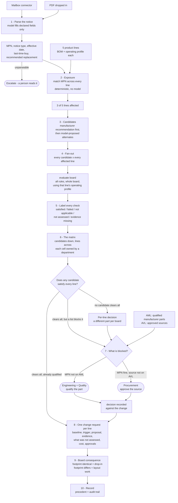

# Continuity 2.0 — specification

What we are building for Scenario B. Read [SCENARIO-B.md](SCENARIO-B.md) for why, and
[FLOW.md](FLOW.md) for the narrative version. This is the contract.

## What it does, in one sentence

When a component goes end-of-life, Continuity works out which of your products are affected,
computes whether each candidate replacement actually works **on each affected board**, and
produces an engineering change request per board with the evidence attached and the open
decisions routed to whoever owns them.

## What is wrong with how it is done today

A parametric cross-reference proposes candidates on matching attributes, an engineer judges
whether they work, and **the same replacement is applied to every affected design in one
step** — because checking each board by hand is too slow. Whether a substitute works depends
on the board it sits in. The right answer differs per board, and the industry's own tooling
assumes it does not.

---

## The flow

### Reading the diagram

**Nothing is applied.** The run ends at a change request awaiting approval. A released design
cannot be altered without sign-off, and a tool that silently rewrites production BOMs is
describing an audit finding rather than a product.

**The operating profile enters at `evaluate`, not at ingestion.** It is what makes the answer
board-specific, and it is the reason a KiCad file alone is not enough — connectivity and
geometry are in the file, load current and ambient are not.

**Two gates, not one.** An unqualified manufacturer part is engineering and quality's
decision. A qualified part from an unapproved source is procurement's. Conflating them was
the error the second research pass caught.

**The matrix can end without a winner.** If no candidate clears every line, the answer is a
different part per board — which is the whole thesis, not a failure of the run.

---

## Data model

### Product line
Replaces "project". The brief's own word, and it names a thing the company ships rather than
an engineer's workspace.

| Field | Note |
|---|---|
| `bom` | Component instances: refdes, manufacturer, exact MPN, footprint, populated? |
| `operating_profile` | See below. Required before any thermal claim. |
| `board` | Optional KiCad artifact, for the footprint consequence |
| `revision` | Which revision these values describe |

### Operating profile
The input that makes us different, and an honest adoption cost.

| Field | Why |
|---|---|
| `v_in` and tolerance | Dissipation depends on the drop |
| `i_load_max` | Continuous. Peaks recorded separately, with duration. |
| `ambient_max_c` | **The local ambient, not the component grade.** These were conflated. |
| `mounting` | Copper area and board construction — the basis for any θJA we apply |
| `source` | Where each number came from. A guess is labelled a guess. |

### AML and AVL are separate lists

- **AML** — manufacturer parts qualified for an internal part number.
- **AVL** — sources permitted to supply them.

A part can be qualified with no approved source, and a source can be approved for a part that
is not qualified. Different lists, different owners, different gates.

---

## Coverage semantics

A bare "pass" is what lets a green cell mean nothing. Every check reports one of five:

| Label | Meaning |
|---|---|
| **Satisfied** | Checked against stated inputs, and it holds |
| **Failed** | Checked, and it does not hold |
| **Not applicable** | This check has no subject on this board |
| **Not assessed** | We do not perform this check |
| **Evidence missing** | We would check it, but an input is absent or unsourced |

**A cell is green only when every applicable check is satisfied.** Anything unassessed or
missing evidence shows on the cell rather than being buried in a drawer.

This is why "nine of ten rules passed" is a number we stop quoting: several rules have no
subject on a two-part board, so the denominator was never ten.

---

## What the engine may and may not conclude

| It may say | It may not say |
|---|---|
| This candidate fails `thermal_dissipation` on line C under the stated profile | This candidate is unsuitable |
| Every applicable check is satisfied | This candidate is approved |
| Output-capacitor stability was **not assessed** | The replacement circuit is stable |
| The footprint differs, so the layout changes | The board will work after the change |

The architecture claim survives a hardware engineer only if it is stated precisely. **No
compatibility verdict is produced by a model** is a statement about *who executes the check*.
It does not claim the inputs are independently verified, or that coverage is complete. The
coverage labels are what make that honest rather than a dodge.

---

## Decisions taken

**θJA is quoted, not looked up.** From the datasheet, with the mounting case named.

For the incumbent it changes no verdict, and saying so is stronger than picking a number:
AMS1117 across its entire published range of **46 to 95 °C/W** puts line C between **52 °C and
81 °C** — passing at every value. The conclusion is robust to the whole spread, which is a
better answer to *"where did that number come from"* than a single confident figure.

**One footprint family for the candidates.** All SOT-223, so thermal resistance is the
variable under test rather than being confounded by physical incompatibility. This is why
ME6211 is out: SOT-23-5 does not fit a SOT-223 land pattern on any line, so it never belonged
in the comparison.

| Part | θJA | Role |
|---|---|---|
| AMS1117-3.3 | 46–95, mounting-dependent | Going end-of-life |
| TLV1117LV33 | 62.9 | Candidate |
| LD1117S33 | 110 | Candidate |
| NCP1117ST33 | 160 | Candidate |

**Ambient and component grade are separate fields.** `ambient_max_c` comes from the operating
profile; `temp_range` stays a component grade. Conflating them was a real defect, and it is
what made the fixture's 25 °C ambient sit unexamined beside a 0–70 °C range.

---

## Open

- Which three of the five lines carry the part, and their operating profiles — the loads that
  make one candidate clear some lines and fail others.
- Whether the footprint rule ships as a real land-pattern comparison or stays a size ceiling
  with the difference reported as *not assessed*.
- Whether the mailbox connector is in the live demo or narrated over a recording.
