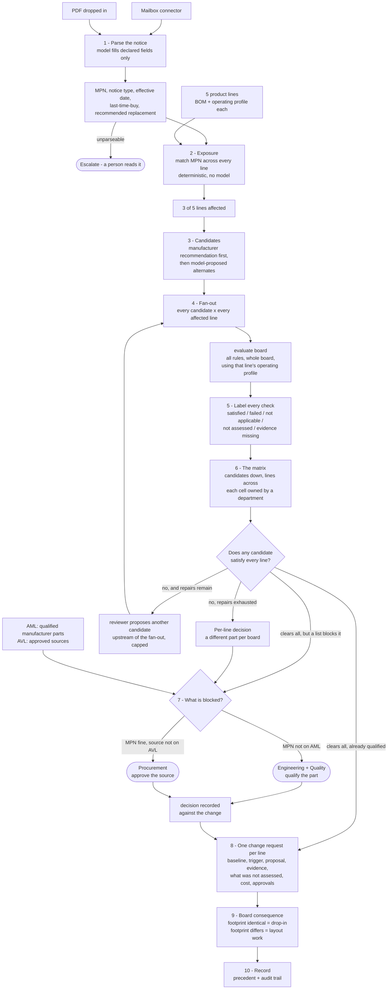

# Continuity 2.0 — specification

What we are building for Scenario B. Read [SCENARIO-B.md](SCENARIO-B.md) for why, and
[FLOW.md](FLOW.md) for the narrative version. This is the contract.

## What it does, in one sentence

When a component goes end-of-life, Continuity works out which of your products are affected,
computes whether each candidate replacement actually works **on each affected board**, and
produces an engineering change request per board with the evidence attached and the open
decisions routed to whoever owns them.

## What is wrong with how it is done today

A parametric cross-reference proposes candidates on matching attributes, an engineer judges
whether they work, and **the same replacement is applied to every affected design in one
step** — because checking each board by hand is too slow. Whether a substitute works depends
on the board it sits in. The right answer differs per board, and the industry's own tooling
assumes it does not.

---

## The flow



### Reading the diagram

**Nothing is applied.** The run ends at a change request awaiting approval. A released design
cannot be altered without sign-off, and a tool that silently rewrites production BOMs is
describing an audit finding rather than a product.

**The operating profile enters at `evaluate`, not at ingestion.** It is what makes the answer
board-specific, and it is the reason a KiCad file alone is not enough — connectivity and
geometry are in the file, load current and ambient are not.

**Two gates, not one.** An unqualified manufacturer part is engineering and quality's
decision. A qualified part from an unapproved source is procurement's. Conflating them was
the error the second research pass caught.

**The matrix can end without a winner.** If no candidate clears every line, the answer is a
different part per board — which is the whole thesis, not a failure of the run.

---

## Data model

### Product line
Replaces "project". The brief's own word, and it names a thing the company ships rather than
an engineer's workspace.

| Field | Note |
|---|---|
| `bom` | Component instances: refdes, manufacturer, exact MPN, footprint, populated? |
| `operating_profile` | See below. Required before any thermal claim. |
| `board` | Optional KiCad artifact, for the footprint consequence |
| `revision` | Which revision these values describe |

### Operating profile
The input that makes us different, and an honest adoption cost.

| Field | Why |
|---|---|
| `v_in` and tolerance | Dissipation depends on the drop |
| `i_load_max` | Continuous. Peaks recorded separately, with duration. |
| `ambient_max_c` | **The local ambient, not the component grade.** These were conflated. |
| `mounting` | Copper area and board construction — the basis for any θJA we apply |
| `source` | Where each number came from. A guess is labelled a guess. |

**The profile's load is declared, not derived, and that is the correct model here.** When
Continuity designs a board from a brief it chose every part, so summing what it placed *is* the
rail load. A product line already exists: it has a BOM of a couple of hundred lines and a power
budget somebody computed once and signed. Deriving the load from the handful of parts we
modelled would under-count by construction, and picking parts until the sum reached the number
we wanted would be fabricating a board out of real components. So `i_load_max` reaches the
engine as `Rail.i_load`, travelling with the basis that says where it came from — the same
discipline as quoting θJA with its mounting condition. Design mode leaves the field unset and
keeps summing parts.

### AML and AVL are separate lists

- **AML** — manufacturer parts qualified for an internal part number.
- **AVL** — sources permitted to supply them.

A part can be qualified with no approved source, and a source can be approved for a part that
is not qualified. Different lists, different owners, different gates.

---

## Rules

Ten today. Three are added, and one existing rule is weaker than its name suggests.

**`footprint` is inert on our boards.** Its docstring says it *"never fails a board — it only
ever raises a flag"*, and it returns nothing at all unless the brief stated a size limit. So
"ten rules ran" was overcounting before coverage labels existed.

| New rule | Question it answers | Why it is not covered today |
|---|---|---|
| **`power_dissipation_max`** | Does computed dissipation exceed the part's own stated absolute maximum? | `PartSpec` has no field for it. A part can sit inside its junction limit and over its power rating — this is a different question from `thermal_dissipation`, and missing it is how a 340 mW load passed against a 300 mW ceiling. |
| **`footprint_compatibility`** | Does the candidate fit the land pattern the outgoing part leaves, and do its pin functions map? | Needs a **baseline** — the part being replaced — which no rule currently has. Distinct from `footprint`, which asks whether a part is under a size target. Both keep their job. |
| **`capacitor_requirements`** | Does the candidate's stated output-capacitor requirement conflict with what is on this board? | Named by research as the first thing a hardware engineer attacks on an LDO substitution. Explicit violations are checkable without simulation, and the four datasheets disagree with each other: AMS1117 asks for *"22 µF solid tantalum"*, TLV1117LV requires *"1.0-µF ceramic… X5R- and X7R-type"* with effective capacitance above 0.5 µF and is *"stable with no ESR"*, NCP1117 and LD1117 characterise at 10 µF. The demo boards carry a 22 µF X5R ceramic, which satisfies TI and is a real open question against AMS1117's tantalum. |

`capacitor_requirements` reports **failed** on an explicit conflict and **evidence missing**
where the requirement is unpublished. It does not claim stability — that needs simulation —
but it turns the first-attack question from *"not assessed"* into an answer.

**AML and AVL are not rules.** They run in the policy layer beside `RULES`. Physics is
derivable from a datasheet; an approval list is derivable from nothing but the company.

### Consequences

**The demo boards gain a capacitor.** Two slots become at least three — regulator, load,
output capacitor — which is more sourcing and also makes them look like boards rather than
fixtures.

**`PartSpec` gains fields**: `p_dis_max`, the θJA mounting condition it was measured under,
and the capacitor requirement (minimum effective capacitance, ESR window, permitted
dielectric).

**`CONSTRAINT_FIELDS` gains entries** so a repair can demand what the new rules check —
`theta_ja_max` so a thermal repair can ask for a better-cooling package class rather than
naming one exact package, `p_dis_min`, and `approved_only` for the policy layer.

---

## Authorisation

The approval gate does not work on the current code, and this is not a detail.

**`/resume` authorises the thread owner.** It calls `store.thread_for_user(thread_id,
user.id)`, so a procurement account cannot resume an engineer's run. Naming a role in the
interrupt payload does not grant anyone the right to answer it.

**Waivers are keyed by `(rule, slot)`** — `graph/state.py:58` — with no candidate or revision.
So an exception approved for one candidate is inherited by the next candidate in that slot.

Both must change for an approval to mean anything:

- A run carries the roles permitted to answer each open decision, and `/resume` checks the
  answering user against that, not against ownership.
- An approval is scoped to **candidate and revision**, and does not survive either changing.
- The record holds identity, timestamp, the rule that fired, and a rationale.

---

## Coverage semantics

A bare "pass" is what lets a green cell mean nothing. Every check reports one of five:

| Label | Meaning |
|---|---|
| **Satisfied** | Checked against stated inputs, and it holds |
| **Failed** | Checked, and it does not hold |
| **Not applicable** | This check has no subject on this board |
| **Not assessed** | We do not perform this check |
| **Evidence missing** | We would check it, but an input is absent or unsourced |

**A cell is green only when every applicable check is satisfied.** Anything unassessed or
missing evidence shows on the cell rather than being buried in a drawer.

### Margin is an attribute, not a sixth label

The engine emits `warn` today for two unrelated things, and they split differently:

- *"runs hot even though 100 °C clears the 125 °C limit"* → **satisfied**, carrying a margin.
  It does hold. It holds narrowly, and the cell shows how narrowly.
- *"could not check — the distributor states no minimum"* → **evidence missing**.

Keeping margin as an attribute rather than a label matters for our own demo: NCP1117ST33 on the
cabinet controller sits at 139 °C against onsemi's 150 °C die limit, having failed the gateway
outright. Calling 139 °C anything other than satisfied would be wrong, and showing it without
the margin would be worse — eleven degrees is exactly what an approver needs to see, and it is
what makes the choice between one qualified part and two approved ones a real decision rather
than an obvious one.

This is why "nine of ten rules passed" is a number we stop quoting: several rules have no
subject on a two-part board, so the denominator was never ten.

---

## Where the fan-out runs

The matrix does **not** route every cell through the graph. Each cell is one
`evaluate(board)` with a candidate substituted — deterministic, fast, no repair loop, no
interrupt.

The graph's repair loop sits **upstream**: it is what proposes further candidates once the
manufacturer's recommendation fails. So repair generates rows; the fan-out fills them.

This is a deliberate choice against the alternative — routing all nine cells through the
graph — which would inherit repair, interrupts and per-cell checkpointing for a case that
needs none of it. Research estimated that integration alone at several engineer-days, and it
would buy nothing the matrix uses. What the graph still owns is candidate generation and the
approval gates.

---

## What the engine may and may not conclude

| It may say | It may not say |
|---|---|
| This candidate fails `thermal_dissipation` on line C under the stated profile | This candidate is unsuitable |
| Every applicable check is satisfied | This candidate is approved |
| Output-capacitor stability was **not assessed** | The replacement circuit is stable |
| The footprint differs, so the layout changes | The board will work after the change |

The architecture claim survives a hardware engineer only if it is stated precisely. **No
compatibility verdict is produced by a model** is a statement about *who executes the check*.
It does not claim the inputs are independently verified, or that coverage is complete. The
coverage labels are what make that honest rather than a dodge.

---

## Decisions taken

**θJA is quoted with its mounting condition, or it is not quoted at all.** Every figure below
was read from the manufacturer's own datasheet and bound to the right column of the right
table. [PARTS.md](PARTS.md) carries the quotes, the listings and the provenance.

| Part | θJA, SOT-223 | The condition it was measured under |
|---|---|---|
| AMS1117-3.3 | 46 to >90 | Copper-area dependent; the datasheet's Table 1 gives 55–80 °C/W by area, on 1/16″ FR-4 with 1 oz copper |
| TLV1117LV33 | 62.9 | TI thermal information, a single package column, unambiguous |
| LD1117S33 | 110 | ST Table 2, SOT-223 column — **Rev 38**; Rev 26 omits it |
| NCP1117ST33 | 160 | **Minimum size pad** — onsemi's own qualifier |

**These four were not measured on the same board, which is why the profile has to state the
copper.** Comparing AMS1117's headline figure against NCP1117's minimum-size-pad figure is
comparing two different installations, and it is the first thing a hardware engineer would
catch. That is what `mounting` is for: the board states its copper area, AMS1117's own table
converts it into a θJA we can quote, and where a manufacturer publishes only one condition we
use that one and name it.

**LD1117S33's 110 °C/W is real, and reading the wrong revision nearly cost us it.** Rev 26 of
ST's datasheet publishes `RthJA` for TO-220 only, so a reader of that document concludes ST
never characterised the part in SOT-223. Rev 38 publishes all four columns — 110 / 55 / 100 /
50 — and the SOT-223 figure has been there since 2012. Two opposite traps for item 5's
extractor, then: taking TO-220's 50 for a SOT-223 part, and concluding from a stale mirror that
nothing was published. Bind the value to the column, and record the revision.

**One footprint family for the candidates.** All SOT-223, so thermal resistance is the
variable under test rather than being confounded by physical incompatibility. This is why
ME6211 is out: SOT-23-5 does not fit a SOT-223 land pattern on any line, so it never belonged
in the comparison.

**Ambient and component grade are separate fields.** `ambient_max_c` comes from the operating
profile; `temp_range` stays a component grade. Conflating them was a real defect, and it is
what made the fixture's 25 °C ambient sit unexamined beside a 0–70 °C range.

---

## The demo case

Five product lines. Three carry AMS1117-3.3; the other two exist so that "3 of your 5 lines"
means something.

Every number below is a distributor row, a datasheet quote, or arithmetic on those two.
[PARTS.md](PARTS.md) is the audit trail.

| Line | Supply | 3V3 load | Ambient | Copper | Dissipation | Role in the story |
|---|---|---|---|---|---|---|
| **A · Sensor node** | 5 V | 150 mA | 25 °C | 1000 mm² | 0.255 W | The easy case |
| **B · Gateway** | 5 V | 420 mA | 45 °C | 1000 mm² | 0.714 W | Kills the manufacturer's own recommendation on **thermal** |
| **C · Cabinet controller** | 12 V | 60 mA | 55 °C | 1000 mm² | 0.522 W | Kills the cool candidate on **voltage** |
| D, E | — | — | — | — | — | Do not contain the part |

All three lines require a commercial **0 to 70 °C** component grade. Widening line C to
industrial −40 to +85 is a deliberate variation held back for Q&A rather than an oversight:
LD1117S33 and NCP1117ST33 are both 0 °C parts, so the same matrix re-run at industrial grade
fails them on `temperature_rating` as well and leaves line C with no candidate at all. That is
a good answer to *"what happens when nothing works"* — shown live, not described.

Load, ambient and copper area are stated by the line's operating profile and cited as such.
They are what a product line's power budget and stackup say — not something we re-derive from a
partial BOM.

Junction temperature is `T_A + P × θJA`, each part against its own published limit:

| | A | B | C |
|---|---|---|---|
| **AMS1117-3.3** — today, 60 °C/W at the stated copper, limit 125 °C | 40 °C | 88 °C | 86 °C |
| **TLV1117LV33** — 62.9 °C/W, limit 125 °C | 41 °C | 90 °C | **fails: 12 V exceeds a 5.5 V ceiling** |
| **LD1117S33** — 110 °C/W, limit 125 °C | 53 °C | 123.5 °C — **1.5 °C of margin** | 112 °C |
| **NCP1117ST33** — 160 °C/W at minimum pad, limit 150 °C | 66 °C | **fails: 159 °C** | 139 °C, 11 °C of margin |

**Every figure in that table is a datasheet reading, and the system has to be *given* them.**
A distributor's parametric fields are a hand-built index over the manufacturer's document,
warranted by nobody: JLCPCB carries `TLV1117LV33DCYR` twice — TI's own listing at a 5.5 V
ceiling and a second manufacturer's at 12 V — and it publishes no junction limit at all for
onsemi's part. Sourced live and unaided, three of these four rows come out of the package
table looking identical. So the matrix rests on verified part facts, `dossier.ENGINEERING_FIELDS`
decides where a datasheet outranks a listing, and item 16's seed is what writes them. Until it
does, this table is what the engine computes from PARTS.md's readings rather than what the
deployed system reaches on its own — see DEFERRED.

Four things this buys:

- **Two different rules fire, and every θJA comes from a datasheet.** `thermal_dissipation` on
  B, `voltage_overlap` on C — the engine is not a thermal calculator with extra steps. And no
  cell rests on our own package table: all four manufacturers published a figure, so every
  number on screen cites a document a judge can open.
- **The incumbent passes everywhere across its entire published spread.** At 46 °C/W the
  gateway sits at 78 °C and at 90 °C/W it sits at 109 °C, both under 125. The boards are fine
  today, the substitution is the whole problem, and the conclusion does not depend on which
  end of AMS1117's range you believe.
- **The manufacturer's own recommendation cooks a board.** NCP1117ST33 is what the notice
  proposes, and on the gateway it lands at 159 °C against onsemi's own 150 °C die limit.
- **No candidate is free, and the cheapest-looking one is the trap.** TLV1117LV33 works on A
  and B but not C. NCP1117ST33 works on A and C, with 11 °C of margin. LD1117S33 clears all
  three — and on the gateway it clears by **1.5 °C**, which no engineer would ship. That last
  cell is the argument for carrying margin as an attribute of a passing check: the engine says
  satisfied, and a person looking at 1.5 °C says no. So the decision put to a human is real.

The PCN recommends **NCP1117ST33** — plausible, since onsemi is a genuine AMS1117 second
source — and it fails the gateway. The manufacturer's own recommendation cooks one of your
boards, which is a documented industry failure mode rather than a contrivance.

---

## How the handoff is shown

The research on enterprise agent evaluation is blunt: *"Nobody puts governance on the
highlight reel"*, and the gap between a demo and something compliance will sign off on is
*"audit logs, human-in-the-loop approvals, and role-based access."* Also worth citing:
**46% of enterprises name integration with existing systems as their primary challenge**
deploying agents.

So the plumbing is the differentiator, and it is shown by its **record**, never by an inbox.

**Intake — the run starts because an email arrived.** Nothing is typed. The first trace line
is *"PCN from Advanced Monolithic Systems, received 09:14"*, sourced from the mailbox. Five
seconds, and it reframes the demo from *I asked a tool* to *the world happened and the system
responded*.

**Handoff — email out, approval in-app.** The send is one-way SMTP, so no round trip sits in
the critical path. The approval is performed by a **different signed-in identity**, because a
second click in the presenter's own session proves nothing — a demo where one person creates
and approves in two minutes is the exact failure sophisticated buyers call out.

What goes on screen is the audit record:

```
Routed to Engineering + Quality · 09:16 · rule: AML gate · evidence: 3 boards, 27 checks
Approved by priya@… · 09:17 · "Qualified on Rev C, evidence QUAL-014"
```

Named identity, timestamp, the rule that fired, and a rationale bound to the decision. That
is the direct answer to *"who approved the decision your agent made three months ago"* — the
question the research says enterprises cannot answer and never demonstrate.

**Approval by replying to the email** uses the same connector in the other direction and is
the answer to *"what if procurement will not log in?"* — a Q&A answer, not the stage path,
because an IMAP round trip on stage is dead air.

**This works only if every part of it is real.** A different identity, a real send, a real
record. Staging any of it collapses credibility on the one beat that invites scrutiny.

---

## Shipping rule

**Nothing is labelled where we could have built it.** *Not assessed* is for work genuinely
outside scope — output-capacitor stability needs simulation and datasheet parameters we do
not hold. It is never a place to put something we chose to skip. A judge who finds a label
covering an unbuilt feature will ask about it first, and the honest answer costs the room.

This is why the footprint rule ships as a real land-pattern and pin-function comparison
rather than a size ceiling with the difference waved at.
